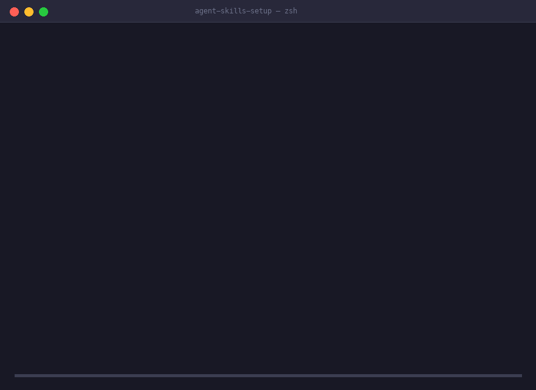

# Agent Context Migrator (Migrador de Contexto de Agentes)

[](https://github.com/Luckycat133/skills-repo)
[](LICENSE)
[](skills/agent-skills-setup/references/ides/openclaw.md)

> Languages: [English](README.md) · [中文](README.zh-CN.md) · [日本語](README.ja-JP.md) · **Español**

Migración, respaldo y restauración de contexto de asistentes de IA (Skills, Reglas/Instrucciones y MCP) entre **Cursor, Claude Code, Codex, Cline, Windsurf, Copilot, Gemini CLI** y decenas de herramientas de programación con IA — **completamente offline, con vista previa y seguro ante rollback**.



---

## ⚡ Instalación Rápida

Instala mediante ClawHub / OpenClaw:

```bash
openclaw skills install @luckycat133/agent-skills-setup
```

O instala directamente desde GitHub:

```bash
git clone --depth 1 --branch v0.9.2 https://github.com/Luckycat133/skills-repo.git

openclaw skills install \
  ./skills-repo/skills/agent-skills-setup \
  --as agent-skills-setup
```

---

## 💬 Dile esto a tu agente

> *"Migra los Skills, reglas y MCP de Cursor en este proyecto a Claude Code."*

> *"Voy a cambiar de computadora. Respalda la configuración de mis IDEs instalados."*

> *"Restaura este paquete ACB en los IDEs instalados de mi nueva computadora."*

---

## 🛡️ Límites de Seguridad de la Migración

| Nivel | Elementos | Comportamiento |
|---|---|---|
| **Automático** | Skills, Instructions/Rules (`CLAUDE.md`, `.cursorrules`), MCP local stdio | Copia verificada de Skills, conversión semántica con reporte de pérdidas, y conversión del subconjunto local stdio de MCP. |
| **Opt-in Explícito** | Copia de paquetes de plugins (`--include-plugins`), traspaso de sesión (`--include-session`) | Conservación estructurada bajo consentimiento y lista blanca estricta. |
| **Lista Manual** | MCP remoto (HTTP/SSE), configuración Cloud/UI, Prompts, Commands, Agents, Hooks | Genera lista de reconstrucción paso a paso (nunca escribe scripts ejecutables no revisados). |
| **Nunca se Mueve** | Claves API, tokens OAuth, credenciales, estado de confianza, historial de chat, memoria | Escaneo estricto de secretos, aislamiento de subobjetos y exclusiones fail-closed. Las credenciales se rechazan o redactan antes de la migración. |

---

## 🚀 Comandos Principales

- **`migrate`**: Flujo completo: `detect` -> `inventory` -> `plan` -> `apply` -> `verify`.
- **`snapshot`**: Captura un paquete atómico **Agent Context Bundle (ACB)** con enlace 1:1 estricto con el manifiesto.
- **`restore`**: Reconstruye un plan de restauración dual desde un ACB hacia el dispositivo de destino con protección TOCTOU.
- **`bundle-sign` & `bundle-verify`**: Firma y verifica paquetes ACB mediante claves criptográficas Ed25519.
- **`doctor`**: Diagnostica dependencias y ejecutables faltantes de forma offline.

---

## 🌟 Apoya el Proyecto

Si Agent Context Migrator te ahorró tiempo configurando o cambiando de equipo, ¡por favor ⭐ **danos una Estrella en GitHub**!

También puedes apoyar el desarrollo mediante [GitHub Sponsors](https://github.com/sponsors/Luckycat133) o [Afdian / Ko-fi](https://afdian.com/a/Luckycat133).

---

## Estructura

```text
skills-repo/
├── docs/                         # Documentación de mantenimiento y listas de lanzamiento
├── scripts/                      # Herramientas de validación del repositorio
└── skills/agent-skills-setup/    # Skill canónico publicable
    ├── SKILL.md                  # Descriptor del Skill y punto de entrada
    ├── references/               # Registro de perfiles v2 y adaptadores
    └── scripts/                  # Motor de migración y herramientas ACB
```

## Desarrollo y Validación

1. Edita `skills/agent-skills-setup/`; no edites el puntero generado en la raíz.
2. Ejecuta la validación completa: `bash validate-all.sh`.
3. Tras modificar el Skill canónico, ejecuta `bash scripts/sync-root-mirror.sh` para actualizar el puntero raíz.
4. Realiza el merge únicamente tras superar todas las validaciones.

## Documentos del Proyecto

- [Guía de contribución](CONTRIBUTING.md)
- [Seguridad](SECURITY.md)
- [Código de conducta](CODE_OF_CONDUCT.md)
- [Licencia](LICENSE)

- [Contribuir](CONTRIBUTING.md)
- [Seguridad](SECURITY.md)
- [Código de conducta](CODE_OF_CONDUCT.md)
- [Licencia](LICENSE)
