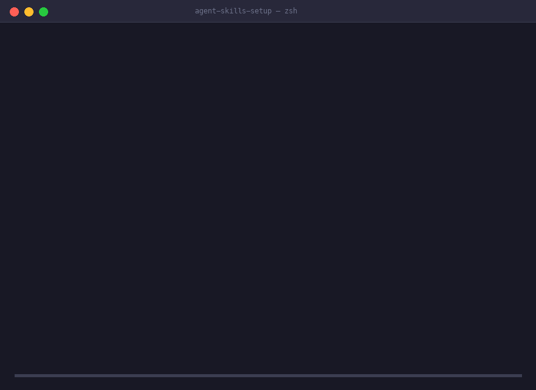

# Agent Skills Setup（エージェントスキル構成）

> Cursor、Claude Code、Codex、Cline、Windsurf、Copilot、Gemini CLI など多数の対応 AI コーディングツール間でコンテキストを移行。

[](https://github.com/Luckycat133/skills-repo)
[](LICENSE)
[](skills/agent-skills-setup/references/ides/openclaw.md)

> Languages: [English](README.md) · [中文](README.zh-CN.md) · **日本語** · [Español](README.es.md)

バージョンは **0.10.0** です。[変更履歴](CHANGELOG.md#0100---2026-10-02)を参照してください。下の GitHub インストール例は対応するリリースタグ `v0.10.0` を使用します。

**Cursor、Claude Code、Codex、Cline、Windsurf、Copilot、Gemini CLI** など、多数の AI コーディングツール間で Skills、ルール/指示、MCP 設定を**オフライン・プレビュー可能・ロールバック安全**に移行・バックアップ・復元します。



---

## ⚡ クイックインストール

ClawHub / OpenClaw からインストール:

```bash
openclaw skills install @luckycat133/agent-skills-setup
```

または GitHub から直接インストール:

```bash
git clone --depth 1 --branch v0.10.0 https://github.com/Luckycat133/skills-repo.git

openclaw skills install \
  ./skills-repo/skills/agent-skills-setup \
  --as agent-skills-setup
```

---

## 💬 エージェントへの指示例

> *"このプロジェクトの Cursor の Skills、ルール、MCP を Claude Code に移行して。"*

> *"PC を移行するので、インストール済み IDE の AI コーディング設定をバックアップして。"*

> *"この ACB バンドルを新しい PC のインストール済み IDE に復元して。"*

---

## 🛡️ 移行の安全境界

| 区分 | 対象 | 動作 |
|---|---|---|
| **自動移行** | Skills、Instructions/Rules (`CLAUDE.md`, `.cursorrules`)、ローカル stdio MCP | Skills の検証付き複製、指示のセマンティック変換と損失レポート、ローカル stdio MCP のサブセット自動変換。 |
| **明示的オプトイン** | プラグインパッケージ複製 (`--include-plugins`)、セッション引き継ぎ要約 (`--include-session`) | 構造化ホワイトリストと同意に基づき処理。 |
| **手動チェックリスト** | リモート MCP (HTTP/SSE)、クラウド/UI 設定、Prompts、Commands、Agents、Hooks | 具体的な再構築手順を出力（未検証の実行可能スクリプトは自動書き込みしません）。 |
| **移行対象外** | API キー、OAuth トークン、資格情報、信頼状態、会話履歴、生成メモリ | 厳格なシークレットスキャン、サブオブジェクト分離、Fail-closed 除外；平文の機密情報は移行前に自動除外・マスキング。 |

---

## 🚀 主なコマンド

- **`migrate`**: 選択した製品を一覧化し、プランを保存してから適用・検証します。
- **`snapshot`**: 1:1 マニフェストファイルバインディングを備えたアトミックでポータブルな **Agent Context Bundle (ACB)** を取得。
- **`restore`**: ACB バンドルからターゲット環境への二者間復元プランを生成し、TOCTOU ガード付きで実行。
- **`bundle-keygen`、`bundle-sign`、`bundle-verify`**: Ed25519 鍵を生成し、ACB バンドルに署名して信頼済み公開鍵で検証。
- **`doctor`**: バンドルの依存関係と不足しているツールをオフラインで診断。

ACB は実行権限を含む通常のファイル権限を保存し、権限メタデータのない旧バンドルも読み込めます。
保存した復元プランはバンドルの識別情報に結び付き、MCP プレビューは資格情報の値を含めずに
サーバーの追加・削除・変更を示します。指示/MCP 変換で報告された損失は明示的な承認が必要です。
`doctor` は実行ファイルの確認に加えて、パッケージ・拡張機能・プラットフォーム・手動インストールの要件を示します。

`detect` / `inventory` で検出と一覧取得、`plan` でプレビュー保存、`apply` で確認済み
プランの実行、`verify` / `rollback` で検証と復旧を行います。
[コマンドガイド](skills/agent-skills-setup/references/cli-workflow.md)と
[互換性マトリクス](docs/agent-skills-setup/compatibility-matrix.md)に、実行例と各 profile
の検証範囲を記載しています。リモート MCP とクラウド設定は手動再構築、プラグインと
引き継ぎの転送はそれぞれ明示的な opt-in が必要です。

---

## 🌟 プロジェクトの支援

Agent Skills Setup が環境構築や PC 移行の手間を省く役に立った場合は、ぜひ ⭐ **GitHub で Star をお願いします**！

[GitHub Sponsors](https://github.com/sponsors/Luckycat133) や [Afdian / Ko-fi](https://afdian.com/a/Luckycat133) からの開発支援も歓迎しています。

---

## 構成

```text
skills-repo/
├── docs/                         # 現行の保守資料・リリースチェックリスト
├── scripts/                      # リポジトリ用検証ツール
└── skills/agent-skills-setup/    # 公開 Skill の正本
    ├── SKILL.md                  # Skill 定義・エントリーポイント
    ├── references/               # Profile 登録表 v2・アダプター仕様
    └── scripts/                  # 移行コアエンジン・ACB ツール
```

## 開発と検証

1. `skills/agent-skills-setup/` を編集し、生成されたルートのリポジトリポインターは編集しません。
2. 正本の Skill を変えたら `bash scripts/sync-root-mirror.sh` でルートポインターを更新します。
3. `bash validate-all.sh` を実行します。
4. すべての検証が通過した後にマージします。

隔離した規模テストは `python3 scripts/benchmark-scale.py --sizes 10,100,1000` で実行します。
移行、保存済みプランの復元、内容の一致、ロールバックを確認します。時間は実測値であり、
CI の合格基準にはしません。`--report /path/to/new-report.json` と `--keep-workspace`
で証拠を保存でき、実際の Agent 設定は読み込みません。

## プロジェクト資料

- [変更履歴](CHANGELOG.md)
- [リリースチェックリスト](docs/agent-skills-setup/release-checklist.md)
- [貢献ガイド](CONTRIBUTING.md)
- [セキュリティ](SECURITY.md)
- [行動規範](CODE_OF_CONDUCT.md)
- [ライセンス](LICENSE)
